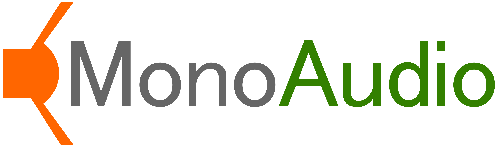

# MonoAudio - .NET Standard Audio Library
A Cross-Platform Audio Library for .NET Standard.

#### Usage of MonoAudio
- An audio output abstraction layer `MonoAudio.Core`

### Currently supported features
- Audio outputs
  - [CSCore](https://github.com/filoe/cscore) Inter-Operating output
  - UWP `AudioGraph` output
- Fast and smooth Upsampling using Catmull-Rom Spline
  - About 80 times faster than real time in 192kHz 2ch on .NET Core, Intel Core i7 4790
  - Uses `MemoryMarshal.Cast<float,Vector2>(Span<float>)` so it doesn't copy while casting.
- `FastFill` for some types that fills quickly using `Vector<T>`.

  
### Currently implemented features(not tested yet)
- Optimized BiQuad Filters that supports some filtering
  - Uses `Vector2` and `Vector3` for filter calculations in each channels.

### Dependencies and system requirements
- Currently, ***Unity IS NOT SUPPORTED AT ALL!***
  - Because Unity uses older version of `Mono`.
- Faster resampling requires `.NET Core` or later version of `Mono`.
  - Unfortunately, `.NET Framework` does not support Fast `Span<T>`s.
- The all processing in this library fully depends on SINGLE core.
  - Because `Span<T>` does not support multi-thread processing at all.

### Useful external library for MonoAudio
- [CSCodec](https://github.com/MineCake147E/CSCodec) that supports more signal processing like FFT and DWT.

### Features under development
- Xamarin.Android `AudioTrack` output
- Xamarin.iOS `AudioUnit` output
- OpenTK `AL` output
