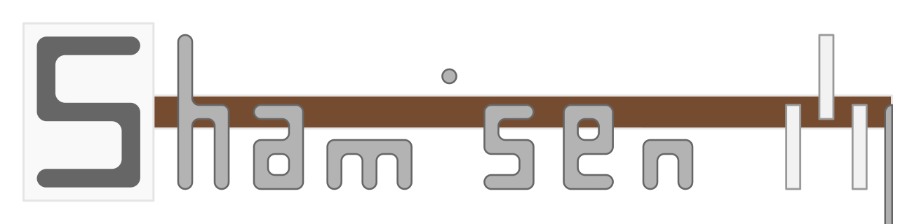

# Shamisen - .NET Audio Library

  
A Cross-Platform Audio Library for:

- .NET 5
- .NET Core 3.1
- .NET Standard 2.1
- .NET Standard 2.0

## Usage of Shamisen

- Abstraction Layer for Audio I/O
- Digital Signal Processing

## Currently implemented features

### Audio I/O and bindings

#### Managed backends

| Name (Backend)                                                                                       | Author (Backend)                          | License (Binding)                                                                      | Windows10 Win32 | Windows10 UWP | Android | Linux | iOS | Mac OSX |
| ---------------------------------------------------------------------------------------------------- | ----------------------------------------- | -------------------------------------------------------------------------------------- | :-------------: | :-----------: | :-----: | :---: | :-: | :-----: |
| [UWP](https://docs.microsoft.com/en-us/windows/uwp/get-started/universal-application-platform-guide) | [Microsoft](https://github.com/microsoft) | [Apache License 2.0](https://github.com/MineCake147E/Shamisen/blob/develop/LICENSE.md) |       ❎        |      ✅       |   ❎    |  ❎   | ❎  |   ❎    |
| [Xamarin.Android](https://github.com/xamarin/xamarin-android)                                        | [Xamarin](https://github.com/xamarin)     | [Apache License 2.0](https://github.com/MineCake147E/Shamisen/blob/develop/LICENSE.md) |       ❎        |      ❎       |   ✅    |  ❎   | ❎  |   ❎    |
| [NAudio](https://github.com/naudio/NAudio)                                                           | [NAudio](https://github.com/naudio)       | [Apache License 2.0](https://github.com/MineCake147E/Shamisen/blob/develop/LICENSE.md) |       ✅        |      ❓       |   ❎    |  ❎   | ❎  |   ❎    |
| [CSCore](https://github.com/filoe/cscore)                                                            | [Florian](https://github.com/filoe)       | [Ms-PL](https://github.com/filoe/cscore/blob/master/license.md)                        |       ✅        |      ❓       |   ❎    |  ❎   | ❎  |   ❎    |
| [OpenTK](https://github.com/opentk/opentk)                                                           | [OpenTK](https://github.com/opentk)       | [Apache License 2.0](https://github.com/MineCake147E/Shamisen/blob/develop/LICENSE.md) |       ✅        |      ❓       |   ❓    |  ❓   | ❓  |   ❓    |

❓: Not Tested or needs more information  
✅: Tested  
❎: Impossible

### Digital Signal Processing (Cross-Platform)

#### Fast and smooth Up-sampling using Catmull-Rom Spline

- Utilizes `System.Numerics.Vectors` and `System.Runtime.Intrinsics` for resampling calculation.
- Uses Direct/Wrapped caching for Catmull-Rom spline coefficients.

[Benchmarks on .Net 5, Intel Core i7 4790](Shamisen.Benchmarks.ResamplerBenchmarks-report-github.md)

#### Fast conversion between PCM sample formats

| To\From | IEEE754 Binary32(float) | 32bit LPCM(Q0.31) | 24bit LPCM(Q0.23) | 16bit LPCM(Q0.15) | 8bit LPCM(Excess-128) | G.711 μ−Law | G.711 A-Law |
|--|:--:|:--:|:--:|:--:|:--:|:--:|:--:|
| IEEE754 Binary32(float) |✖️|✅|✔️|✅|✅|✅|✅|
| 32bit LPCM(Q0.31) |✅|✖️|☑️|☑️|☑️|☑️|☑️|
| 24bit LPCM(Q0.23) |✔️|☑️|✖️|☑️|☑️|☑️|☑️|
| 16bit LPCM(Q0.15) |✅|☑️|☑️|✖️|☑️|☑️|☑️|
| 8bit LPCM(Excess-128) |✔️|☑️|⭕|☑️|✖️|☑️|☑️|
| G.711 μ−Law |❎|❎|❎|❎|❎|✖️|❎|
| G.711 A-Law |❎|❎|❎|❎|❎|❎|✖️|

Legends:  
✅: Shamisen has optimized implementation of direct conversion.  
☑️: Shamisen can handle conversion by 2 or more converter. Can be partially optimized.  
✔: Shamisen has simple implementation of direct conversion.  
⭕: Shamisen can handle conversion by 2 or more converter. Both converter is implemented in simple way.  
❎: Shamisen has no support for conversion.  
✖️: No conversion needed(same format).  

#### Optimized BiQuad Filters that supports some filtering

- Uses `Vector2` and `Vector3` for filter calculations in each channels.
- Unrolls channel loop for Monaural and <5ch filter calculation.
- For some special cases, it utilizes SSEx.x and AVX(2) intrinsics for the calculation.

#### Other Features

- `FastFill` for some types that fills quickly using `Vector<T>`.

### File Formats and Codecs

#### Cross-Platform

| Container Name    | Typical File Extensions | Implemented Codec                              | Library contains Decoder/Encoder | License                                                                                | Decoding |  Encoding   |
| ----------------- | ----------------------- | ---------------------------------------------- | -------------------------------- | -------------------------------------------------------------------------------------- | :------: | :---------: |
| Waveform RF64 | `.wav`                  | Linear PCM, IEEE 754 Floating-Point PCM, A-Law, μ-law | Shamisen                         | [Apache License 2.0](https://github.com/MineCake147E/Shamisen/blob/develop/LICENSE.md) |    ✅    |     ✅      |
| FLAC              | `.flac`                 | FLAC                                           | Shamisen                         | [Apache License 2.0](https://github.com/MineCake147E/Shamisen/blob/develop/LICENSE.md) |    ✅    | ❎(Planned) |

Legends:  
✅: Supported by Shamisen itself  
✔: Supported by another library and its wrapper for Shamisen  
❎: Not supported by Shamisen without any custom integration

#### Platform-Dependent

- Any formats supported by platform-dependent binding libraries

## Dependencies and system requirements

- Currently, **_Unity IS NOT SUPPORTED AT ALL!_**
- Requires [DivideSharp](https://github.com/MineCake147E/DivideSharp) for frequently appearing divide-by-number-of-channels operations.
- Faster resampling requires `.NET 5` or `.NET Core 3.1`.
  - Unfortunately, older versions doesn't support Hardware Intrinsics.
- The all processing in this library fully depends on SINGLE core.
  - Because `Span<T>` does not support multi-thread processing at all.

## Useful external library for Shamisen

- [CSCodec](https://github.com/MineCake147E/CSCodec) that supports more signal processing like FFT and DWT.

## Features planned or under development

### Audio I/O and bindings

#### Native backends

✅: Possible  
❓: Needs more information  
❎: Impossible

| Name of Backend                        | Author of Backend                   | License (binding)                                                                      | Target Platform | Status                |
| -------------------------------------- | ----------------------------------- | -------------------------------------------------------------------------------------- | --------------- | --------------------- |
| [Oboe](https://github.com/google/oboe) | [Google](https://github.com/google) | [Apache License 2.0](https://github.com/MineCake147E/Shamisen/blob/develop/LICENSE.md) | Android >10     | Gathering Information |

#### Managed backends

✅: Possible  
❓: Needs more information  
❎: Impossible

| Name of Backend | Author of Backend | License (binding)                                                                      | Target Platforms | Status  |
| --------------- | ----------------- | -------------------------------------------------------------------------------------- | ---------------- | ------- |
| Xamarin.iOS     | Microsoft         | [Apache License 2.0](https://github.com/MineCake147E/Shamisen/blob/develop/LICENSE.md) | iOS              | Planned |

### File Formats and Codecs

#### Cross-Platform

✅: Shamisen will have Managed Implementation of decoder/encoder itself  
⭕: Shamisen will have Managed Wrapper for another library  
❎: Not included in plan currently

| Container Name | Typical File Extensions | Target Codec | Planned Library containing Decoder/Encoder          | Planned Library License                                                                | Decoding | Encoding | Status              |
| -------------- | ----------------------- | ------------ | --------------------------------------------------- | -------------------------------------------------------------------------------------- | :------: | :------: | ------------------- |
| FLAC           | `.flac`                 | FLAC         | Shamisen                                            | [Apache License 2.0](https://github.com/MineCake147E/Shamisen/blob/develop/LICENSE.md) |    ✅    |    ✅    | Implemented Decoder |
| Opus           | `.opus`                 | Opus         | Shamisen(Decoder) Shamisen.Codecs.Opus(Encoder) | [Apache License 2.0](https://github.com/MineCake147E/Shamisen/blob/develop/LICENSE.md) |    ✅    |    ⭕    | Planned             |
| Ogg            | `.ogg`                  | Vorbis       | Shamisen.Codecs.Ogg                                 | [Apache License 2.0](https://github.com/MineCake147E/Shamisen/blob/develop/LICENSE.md) |    ⭕    |    ⭕    | Planned             |
